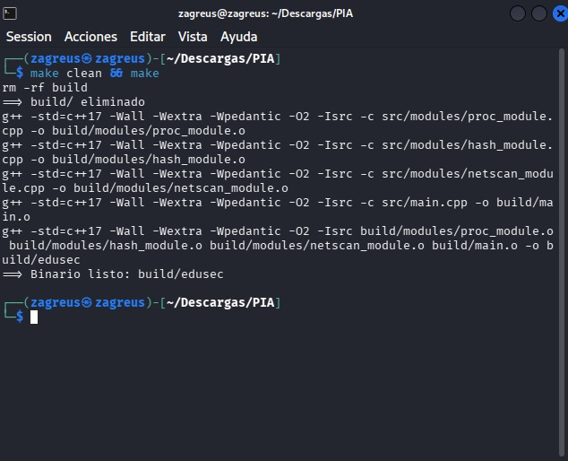
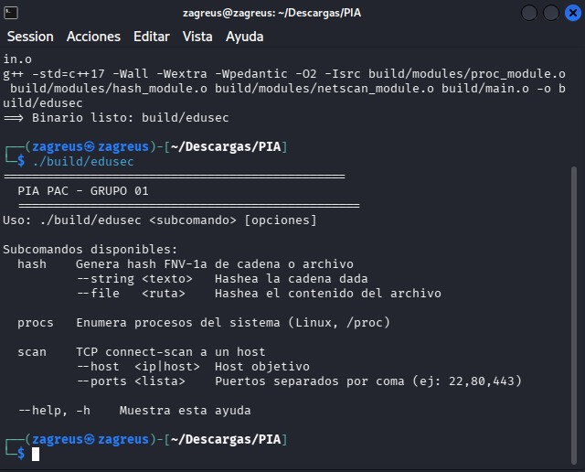

# EduSec Toolkit - PIA PAC - GRUPO 01

---

## 1. Objetivo del proyecto

Diseñar e implementar en C++ un **toolkit educativo modular** que demuestre, de
forma benigna y reproducible, varias técnicas fundamentales de ciberseguridad
(hashing, enumeración de procesos, reconocimiento de red), sirviendo como base
para los análisis estático, dinámico y de ingeniería inversa de fases
posteriores.

## 2. Descripción técnica del componente

`EduSec Toolkit` es una aplicación de línea de comandos en C++17 que expone
varios módulos seleccionables por subcomando:

| Módulo     | Subcomando | Técnica demostrada                              | Estado primer avance |
|------------|------------|-------------------------------------------------|----------------------|
| `hash`     | `hash`     | Hashing FNV-1a/32 sobre archivos y strings      | Funcional            |
| `procenum` | `procs`    | Enumeración de procesos vía `/proc`             | Funcional            |
| `netscan`  | `scan`     | TCP connect-scan con sockets POSIX y timeout    | Funcional (básico)   |

El programa entra por `src/main.cpp`, parsea el subcomando y despacha al módulo
correspondiente.

Técnicas planeadas a lo largo del PIA (no todas en este avance): programación
de bajo nivel (manejo de archivos, sockets, memoria), sniffing pasivo,
fuerza bruta de hashes, enumeración local, análisis estático/dinámico
(Ghidra, Radare2, x64dbg) y técnicas defensivas/evasión éticas.

## 3. Alcance y límites

**Sí implementará:**

- Toolkit modular en C++17, compilable con `g++` estándar.
- Hashing reproducible de archivos y cadenas.
- Enumeración local de procesos en Linux.
- Reconocimiento TCP básico (Fase II).
- Logging estructurado a `stdout` y archivo.

**No implementará (fuera de alcance):**

- Persistencia, instalación como servicio o auto-arranque.
- Exfiltración de datos hacia servidores externos.
- Explotación de vulnerabilidades reales contra software de terceros.
- Capacidades destructivas (cifrado de archivos del usuario, borrado, etc.).
- Ejecución fuera de máquinas virtuales aisladas controladas por el equipo.

El binario es **benigno y no persistente**; cualquier prueba se realiza en VMs
de laboratorio sin acceso a redes productivas.

## 4. Cómo compilar

Requisitos: `g++` con soporte C++17 (`>= 7.0`) y `make`. No requiere librerías
externas en este primer avance.

```bash
cd PIA
make
```

El binario se genera en `build/edusec`.

Para limpiar artefactos:

```bash
make clean
```

## 5. Cómo ejecutar

```bash
# Mostrar ayuda
./build/edusec --help

# Hashing de una cadena
./build/edusec hash --string "hola mundo"

# Hashing de un archivo
./build/edusec hash --file /etc/hostname

# Enumeración de procesos del sistema (Linux)
./build/edusec procs

# Reconocimiento TCP — reporta cada puerto como ABIERTO o CERRADO
./build/edusec scan --host 127.0.0.1 --ports 22,80,443
```

## 6. Integrantes y responsabilidades técnicas


| Integrante               | Matrícula | Módulo / Responsabilidad principal               |
|--------------------------|-----------|--------------------------------------------------|
| Josue Arcos              |  2009127  | Coordinación técnica, `main.cpp` y dispatcher    |
| Johan Garay/Josue Arcos  |  2001776  | Módulo `hash` (hashing y futura fuerza bruta)    |
| Johan Garay	           |  2001776  | Módulo `procenum` (enumeración local)            |
| Andrea Abundiz           |  2051169  | Módulo `netscan` (TCP scan + ampliaciones)       |
| Andrea Abundiz           |  2051169  | Documentación, evidencias y análisis estático    |

## 7. Estructura de directorios

```
PIA/
├── README.md
├── Makefile
├── .gitignore
├── src/
│   ├── main.cpp
│   └── modules/
│       ├── hash_module.h
│       ├── hash_module.cpp
│       ├── proc_module.h
│       ├── proc_module.cpp
│       ├── netscan_module.h
│       └── netscan_module.cpp
├── docs/
│   └── design.md
└── evidence/       
```

## 8. Tag del primer avance

```bash
git add .
git commit -m "PIA: primer avance — EduSec Toolkit"
git tag -a pia-avance-1 -m "PIA: primer avance — EduSec Toolkit"
```

---

## 9. Evidencias de funcionamiento (Primer Avance)

A continuación, se presentan las capturas de pantalla que demuestran el cumplimiento de los objetivos técnicos del primer avance.

### A. Compilación exitosa del Toolkit

Esta imagen demuestra que el entorno de desarrollo está configurado correctamente. Se ejecuta `make clean` para asegurar una compilación limpia, seguida de `make`. Se observa el uso de banderas de compilación estrictas (`-Wall -Wextra -Wpedantic -std=c++17`) y la generación final del binario `build/edusec`.



### B. Ejecución y menú de ayuda

Esta imagen confirma que el binario generado es ejecutable y que el sistema de despacho de subcomandos funciona. Al ejecutar `./build/edusec` sin argumentos (o con `--help`), el toolkit despliega correctamente el menú de ayuda, listando los módulos operativos (`hash`, `procs`, `scan`) y sus opciones.


